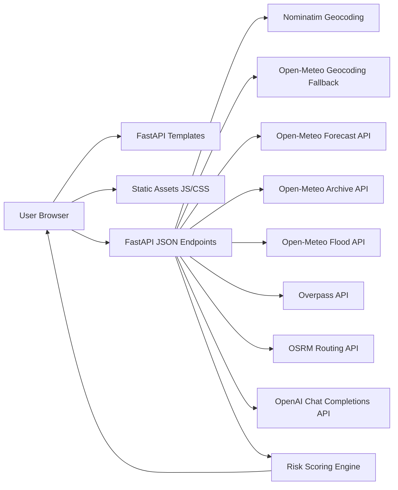
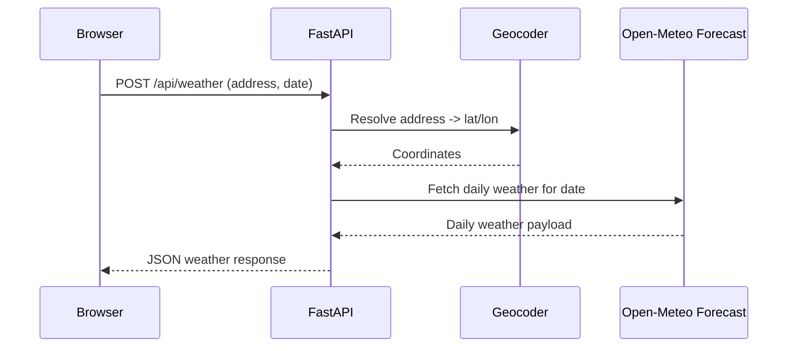
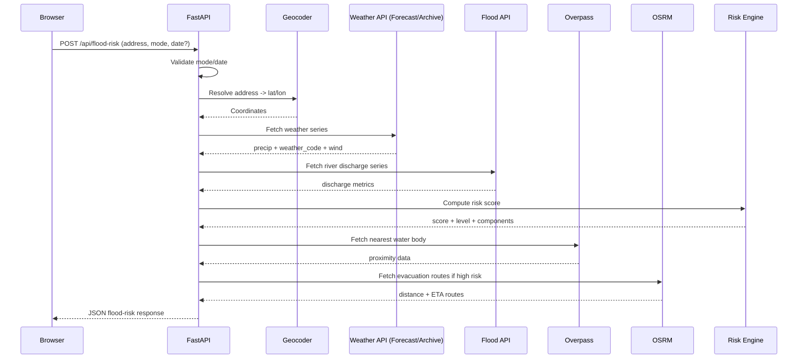

# Weather + Flood Risk App Architecture

## 1. Purpose

This document explains the internal architecture of the Weather + Flood Risk App, including:

- system boundaries
- runtime components
- request/data flows
- integration points with external providers
- risk scoring logic
- reliability and validation patterns

---

## 2. High-Level Architecture

The application is a monolithic FastAPI service with server-rendered pages and client-side fetch calls.

---

## 3. Code Component Map

## Backend

- [app/main.py](../app/main.py)
  - FastAPI app initialization
  - UI route handlers
  - JSON API handlers
  - external API client functions
  - flood-risk scoring logic
  - validation and error handling

## Frontend

- [app/templates/index.html](../app/templates/index.html)
  - Weather page markup
- [app/templates/flood.html](../app/templates/flood.html)
  - Flood risk page markup
- [app/static/app.js](../app/static/app.js)
  - Weather page fetch + render logic
- [app/static/flood.js](../app/static/flood.js)
  - Flood page fetch + mode handling + submit lock
- [app/static/styles.css](../app/static/styles.css)
  - shared visual theme and layout

---

## 4. Route Architecture

## UI routes

- `GET /` -> renders weather page
- `GET /flood-risk` -> renders flood-risk page
- `GET /social` -> renders social community page

## API routes

- `POST /api/weather`
  - Inputs: `location`, `date_str`
  - Output: weather metrics for selected date

- `POST /api/flood-risk`
  - Inputs: `address`, `mode`, optional `date_str`
  - Output:
    - `historical`: single-day weather/flood metrics + derived risk score and level
    - `forecast`: current day summary + `forecast_7days` array (7 daily weather/flood/risk entries)
    - `water_proximity`: nearest water body information for selected location
      - includes nearest river and nearby lakes list
    - `evacuation_routes`: suggested routes when high-risk threshold is met

- `GET /api/social/posts`
  - Inputs: optional `tab`
  - Output: social posts and replies for one tab or all tabs

- `POST /api/social/posts`
  - Inputs: `tab`, `message`, optional `created_at`
  - Output: created post + refreshed tab list

- `POST /api/social/replies`
  - Inputs: `tab`, `post_id`, `message`, optional `created_at`
  - Output: created reply + updated post

- `POST /api/social/posts/update-time`
  - Inputs: `tab`, `id`, `created_at`
  - Output: updated post timestamp

- `DELETE /api/social/posts`
  - Inputs: query params `tab`, `post_id`
  - Output: deleted post + refreshed tab list

- `POST /api/assistant`
  - Input: JSON `{ message }`
  - Output: AI assistant response text
  - Runtime behavior:
    - uses OpenAI Chat Completions when `OPENAI_API_KEY` is configured
    - falls back to built-in app-specific guidance if key is missing or upstream fails

---

## 5. Weather Flow (Runtime)

Key internal steps:

1. Validate `date_str`.
2. Geocode address.
3. Fetch daily weather variables.
4. Parse selected-day values.
5. Return normalized response object.

---

## 6. Flood Risk Flow (Runtime)

Mode-specific behavior:

- `forecast` mode
  - target date = server current date
  - weather source = forecast endpoint
  - returns 7-day outlook (current day + next 6 days)

- `historical` mode
  - requires explicit date input
  - rejects future dates
  - weather source = archive endpoint
  - computes 3-day and 7-day antecedent precipitation

UI enforcement:

- the historical date input is only visible/required when `historical` mode is selected
- in `forecast` mode, historical date input is hidden and excluded from form submission

---

## 7. Geocoding Strategy

Geocoding is address-first for higher accuracy:

1. Try Nominatim (address-friendly lookup)
2. Fallback to Open-Meteo geocoding if no Nominatim result

This prevents ambiguous city/state matches that can occur with coarse geocoding.

---

## 8. Flood Risk Scoring Architecture

The risk score is a bounded heuristic score in the range 0-100.

Inputs used:

- same-day precipitation
- antecedent precipitation (3-day and 7-day)
- river discharge magnitude
- discharge variability (`max / mean`)
- severe weather code indicator
- wind intensity

Output model:

- `score`: integer 0-100
- `level`: categorical band (`Low`, `Moderate`, `High`, `Very High`, `Severe`)
- `components`: contribution breakdown by factor

Risk-triggered response behavior:

- if risk is `High`, `Very High`, or `Severe` (or score threshold), evacuation route generation is enabled
- otherwise, response includes empty `evacuation_routes`

This design allows:

- explainability (via component scores)
- easy threshold tuning
- future model replacement without changing API shape

---

## 9. Error-Handling Design

Backend protections:

- input validation errors return 400
- unresolved locations return 404
- upstream provider HTTP failures return controlled 502 messages
- upstream connectivity failures return 503

Frontend protections:

- submit lock to prevent duplicate in-flight requests
- robust JSON/non-JSON response parsing
- user-readable status messages

External dependency protections:

- water proximity is best-effort and degrades gracefully when unavailable
- routing failures fall back without breaking flood-risk response

---

## 10. Frontend UX Architecture

Shared UI patterns:

- top navigation bar on both pages (`Flood Risk Forecast` first, then `Weather`)
- single shared CSS theme
- card-based result rendering
- icon-enhanced result cards for quick visual scanning
- progressive status text (loading -> success/error)
- strict `[hidden]` CSS handling to ensure hidden controls are not displayed

Form behavior:

- weather page: direct date + address submission
- flood page:
  - mode toggle controls whether historical date input is visible/required
  - forecast mode renders both summary card and 7-day outlook cards
  - evacuation routes are visualized on an interactive map (OpenStreetMap/Leaflet) when routes are available

---

## 11. Configuration and Environment

Current model:

- no environment secrets required (Open-Meteo public endpoints)
- all providers accessed via HTTPS

Potential production extensions:

- configurable request timeout and retry settings
- provider endpoint URLs moved to environment variables
- per-provider circuit breaker or fallback policies

---

## 12. Performance Considerations

Current characteristics:

- lightweight async HTTP requests
- mostly I/O-bound external calls
- SQLite persistence for social posts/replies (`app/social.db`)

Potential improvements:

- cache geocoding responses by normalized address
- cache recent weather/flood results for short TTL
- parallelize weather and flood upstream calls after geocode

---

## 13. Security Considerations

Implemented basics:

- server-side validation of mode/date
- controlled upstream error exposure
- no credentials embedded in client code

Recommended next steps:

- request rate-limiting on API endpoints
- stricter input length limits
- observability (request IDs, structured logging)

---

## 14. Deployment Topology (Suggested)

Minimal deployment layout:

- FastAPI app behind reverse proxy
- TLS termination at proxy/load balancer
- horizontal scaling possible (stateless app)
- optional CDN for static assets

---

## 15. Extension Points

Good next enhancements:

- expose confidence/uncertainty band in risk output
- add map visualization of resolved coordinate
- add historical trend chart for discharge + precipitation
- persist request history for audit and comparison
- introduce automated tests for risk-scoring thresholds

---

## 16. Architectural Summary

The app uses a clean, modular monolith pattern:

- one backend service for rendering and API orchestration
- clear split between UI handlers and data integration functions
- deterministic, explainable flood-risk engine
- robust handling for real-world provider variability

This structure is simple to operate now and flexible for future scaling.
